# 👋 Hey

I design and run self-hosted and cloud systems with a focus on reproducibility, automation, and reliability.

## 🚀 Focus

- Self-hosted infrastructure (NixOS + containers)  
- AWS deployments with CI/CD pipelines  
- Workflow automation and data pipelines  
- Reproducible system design  

## 🛠️ Tech Stack

**Languages**  
Python · JavaScript · Bash  

**Frameworks & Tools**  
FastAPI · Express  
Docker · Podman  
GitHub Actions · AWS CodePipeline  

**Cloud & Infrastructure**  
AWS (ECS, ECR, RDS, ALB)  
NixOS (declarative systems)  
Self-hosted stack (Caddy, Postgres, Redis, n8n, etc.)  

## 📌 Projects

**🖥️ Homelab Infrastructure**  
Declarative NixOS-based homelab with reproducible configs, containerized services, and automated orchestration via Podman Quadlets.

**🧠 Automated Knowledge Pipeline**  
End-to-end pipeline that ingests feeds, filters noise, batches processing, and generates structured summaries using LLM workflows in n8n.

**📝 Notes App (AWS)**  
Full-stack containerized application deployed on ECS Fargate with CI/CD, load balancing, and managed database.

**🗳️ Vote-Sutra**  
Ethereum-based voting system with smart contracts, backend API, and independent on-chain vote verification.

## 📊 Stats
 

  

## 🌍 Connect

- [GitHub](https://github.com/Reputable2772/)  
- [LinkedIn](https://www.linkedin.com/in/chiranthan-bharadwaj-r-0b8361335/)

---

> If it breaks, fix it. If it repeats, automate it.